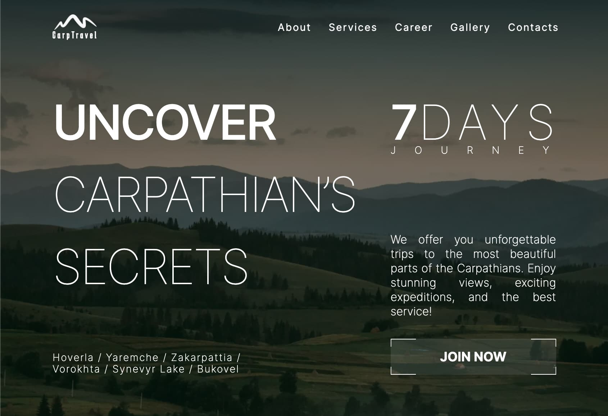
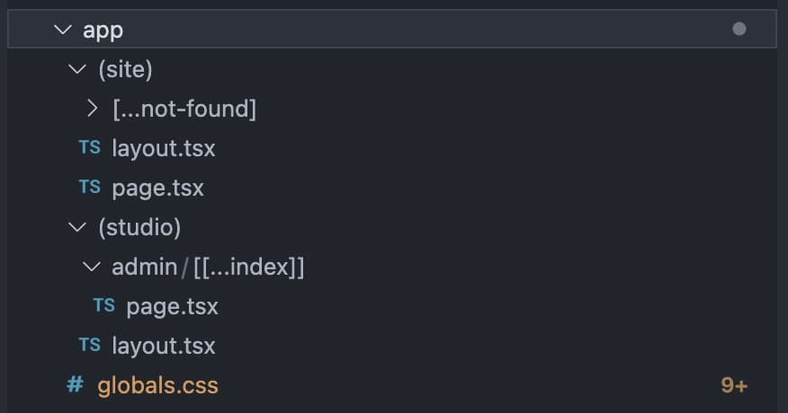

# Carptravel

<a href="https://nextjs-carptravel-02.vercel.app" 
    target="_blank"
    rel="nofollow noopener noreferrer" 
    style="background-color: teal; color: white; padding: 4px; border-radius: 4px; display: inline-block; width: 100px; text-align: center">View DEMO</a>

---

A landing page of a Ukrainian travel company that shows the user information
about the company, a basic set of services, and also provides an opportunity to
send an application and join the team.

## Creating

The project was built using **`npx create-next-app@latest`**, which set up
initial project structure automatically including **TS**, **ESLint**, **Tailwind
CSS**, App Router, 'src/' directory and import alias (@/\*) as well. To get
acquainted and configure additional features refer to
[documentation](https://nextjs.org/).

It has responsive (till screen width 480px) and adaptive (more than 480px)
design. General styles were created using
**[Tailwind CSS](https://tailwindcss.com/)**. Some specific elements (such as
pseudo-elements or background images) were styled with **CSS**.

Image sliders for sections "Services" and "Gallery" were implemented using
**[Swiper](https://swiperjs.com)**.

Forms were created and validated using
**[React Hook Form](https://react-hook-form.com/)** combining with
**[react-input-mask](https://www.npmjs.com/package/react-input-mask-3.0/v/3.0.0)**
package.

The project is connected to simplified embedded
**[Sanity Headless CMS](https://www.sanity.io/)** and uses additional json-files
as reserve source of text data. The app directory consists of 2 groups of
routes: **`(site)`** and **`(admin)`** that include website main UI and CMS
interface respectively.

## Dependencies and technologies

- _Next.js_
- _React.js_
- _TypeScript_
- _Sanity_
- _Swiper_
- _React Hook Form_
- _React Input Mask (3.0.0-alpha.2)_
- _React Toastify_
- _Tailwind CSS_
- _Framer Motion_

Full list of dependencies and additional information is available in
**`package.json`** file.
